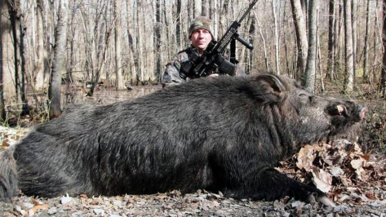

# Applications 8.4: Solving Radical Equations

## Overview

In this exercise, you'll work with a small group to apply what you learned in the Guided Practice to a real-life situation. Remember that when working in your groups, it's important to: 

+ __Ask questions__ -- even if it's over something simple or something you've seen before. 
+ __Contribute thoughts__ -- realize your perspective is valuable, and you can have something positive to contribute even if you are not sure of something. 
+ __Work actively__ -- keep the discussion going and don't let yourself slip into being just a passive listener. 
+ __Stay positive__ -- be welcoming and encouraging of others, use positive language, and have fun. 

## Activation 

Before you begin on the main exercises, answer the following questions in your group. 

1. How do you solve an equation that involves a single square root? 
2. How do you solve an equation that involves two square roots? 
3. How do you solve an equation that involves a single higher root (like a cube root or fifth root)? 

## Exercises

### Exercise 1: Look out below

When an object is dropped from a height of $h$ feet, the time it will take to hit the ground can be approximated by the formula 

$$t = \sqrt{\frac{2h}{32}}$$

where $t$ is the time in seconds for the object to fall $h$ feet. 

1. How long will it take an object to fall 100 feet?
2. A skydiver accidentally drops his camera after jumping out of an airplane, at a height of about 3000 feet. How long will it take for the camera to hit the ground? 
3. A spotter on the ground following the skydiver in question 2 sees another skydiver accidentally knock one of the spare parachutes out of the plane. About 20 seconds later the parachute crashes into the ground. How high was the plane when the parachute fell out? 

### Exercise 2: Mammal measurements part 2

In the previous application problem set we looked at the model 

$$L(M) = 0.330 \sqrt[3]{M}$$

where $L(M)$ represents the body length in meters of a mammal with a body mass of $M$ kilograms. 

1. Use the model to estimate the length of an animal whose body mass is 30kg. 
2. The photo below made the rounds on social media recently: 

The wild boar pictured here looks to be about 8 meters long. [A news item on this incident](http://news.yahoo.com/giant-hog-boar-hunter-caught-500-pounds-133815315.html) says that the board was 500 pounds. How close is this to the weight that the model above would predict? (Warning: Pay close attention to the units of measurement here.) 

### Exercise 3: Equation solving review 

Solve each of the following equations. Note that not all of these are radical equations. 

+ $4t^2 + 3t = 232$
+ $30(0.7)^x = 17$
+ $45\sqrt{3 - x} = 90$ 
+ $6t + 8 = 3(t-4)$ 
+ $5\sqrt{x-8} = \sqrt{x+4} + 6$

## Conclusions

On a separate paper, take no more than three minutes and give a substantive response to each of these questions: 

1. In 2-3 sentences, what did you accomplish in your group work today? 
2. What's 1-2 interesting math-related things you learned in your group work today? 
3. What's the muddiest point for you, from the group work today? 

